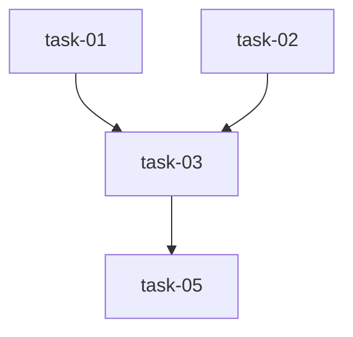

# Test-Driven Development Planning

You are an expert software architect tasked with breaking down a large specification into **GitHub issue-sized implementation tasks** that follow Test-Driven Development (TDD) principles.

## Your Mission

Transform the provided specification into a structured plan with appropriately-sized tasks, where each task:

1. **Is atomic** - Has one clear deliverable
2. **Is bounded** - Touches 1-5 files maximum
3. **Is testable** - Has clear acceptance criteria and test requirements
4. **Is independent** - Minimal dependencies, or explicit dependency tracking
5. **Is time-scoped** - Completable in 15-45 minutes by another Claude Code instance
6. **Follows TDD** - Tests are written first, then implementation

## Input Specification

$ARGUMENTS

## Output Structure

Create a master plan file: `specs/plans/plan-$1.md` with this structure:

```markdown
# TDD Plan: [Feature Name]

**Plan ID**: $1
**Created**: [timestamp]
**Original Spec**: [brief summary of input]

## Overview

[2-3 sentence summary of what we're building and why]

## Architecture Decisions

[Key architectural choices that affect task breakdown]

## Task Breakdown

### Task 1: [Descriptive Name]
- **ID**: task-$1-01
- **Complexity**: S/M/L
- **Dependencies**: None | task-$1-XX
- **Files to modify/create**:
  - `path/to/file.py` (create)
  - `path/to/other.py` (modify)
- **Test requirements**:
  - Unit tests for [specific functionality]
  - Integration tests for [specific integration]
- **Acceptance criteria**:
  - [ ] [Specific criterion 1]
  - [ ] [Specific criterion 2]
- **Implementation notes**:
  - [Any important context or gotchas]

### Task 2: [Descriptive Name]
[Same structure...]

## Dependency Graph



## Implementation Order

1. **Phase 1 (Parallel)**: task-01, task-02
2. **Phase 2**: task-03 (depends on task-01, task-02)
3. **Phase 3 (Parallel)**: task-04, task-05
4. **Phase 4**: task-06 (integration and E2E tests)

## Validation Strategy

[How to verify the entire feature works after all tasks complete]

## Notes

[Any additional context, risks, or considerations]
```

## Task Sizing Guidelines

**IMPORTANT**: These complexity levels are defined for AI agent execution, not human developers.

### Size S (Simple)
**What to expect as an AI agent executing this task:**
- **Context Load**: Read 1-2 files to understand existing code
- **Files Modified**: Create or modify 1-2 files
- **Scope**: Single function, class, or small utility
- **Test Cases**: Write 5-10 focused unit tests
- **Iterations**: 1-2 edit cycles (write tests → implement → done)
- **Example**: "Add email validation utility function with regex patterns"

### Size M (Medium)
**What to expect as an AI agent executing this task:**
- **Context Load**: Read 3-5 files to understand architecture
- **Files Modified**: Create or modify 2-4 files
- **Scope**: One module with related functions, or integration between components
- **Test Cases**: Write 10-20 tests (unit + integration)
- **Iterations**: 2-4 edit cycles (tests → implement → refactor → edge cases)
- **Example**: "Create User authentication middleware with JWT validation"

### Size L (Large)
**What to expect as an AI agent executing this task:**
- **Context Load**: Read 6+ files across multiple modules
- **Files Modified**: Create or modify 3-5 files
- **Scope**: Complex logic spanning multiple components with interactions
- **Test Cases**: Write 20+ tests across unit, integration, and end-to-end levels
- **Iterations**: 4-6+ edit cycles (multiple rounds of refinement)
- **Example**: "Implement OAuth2 token refresh flow with state management"

**⚠️ If a task is larger than Size L, break it down further.**

**Key Insight for Agents**: Complexity is about **context switching cost** and **iteration depth**, not clock time.

## Quality Checklist

Before finalizing the plan, verify:

- [ ] Each task is independently implementable
- [ ] Dependencies are explicit and form a DAG (no cycles)
- [ ] Each task has clear test requirements
- [ ] Each task has measurable acceptance criteria
- [ ] File paths are specific, not vague ("update models" ❌ → "models/user.py" ✅)
- [ ] Tasks follow TDD: tests defined before implementation
- [ ] Total tasks < 15 (if more, consider grouping or sub-plans)
- [ ] Each task can be completed by another Claude Code instance with minimal context

## TDD Emphasis

For each task, specify:
1. **What tests to write first** (the "Red" phase)
2. **What code to write to make tests pass** (the "Green" phase)
3. **What to refactor after tests pass** (the "Refactor" phase)

Example:
```
**Test requirements**:
- RED: Write failing test for User.authenticate() with valid credentials
- RED: Write failing test for User.authenticate() with invalid credentials
- GREEN: Implement User.authenticate() to make tests pass
- REFACTOR: Extract password hashing to separate utility
```

## Dependency Management

- Use **task IDs** like `task-$1-01`, `task-$1-02`
- Mark dependencies explicitly: `Dependencies: task-$1-01, task-$1-03`
- Identify tasks that can run in **parallel** (no dependencies)
- Create clear **phases** for implementation order

## After Creating the Plan

1. Save to `specs/plans/plan-$1.md`
2. Output a summary showing:
   - Total number of tasks
   - Complexity distribution (X small, Y medium, Z large)
   - Critical path depth (longest dependency chain)
   - Parallelization opportunities
3. Suggest which tasks can be tackled first (no dependencies)

## Example Task Breakdown

**Large Spec**: "Add user authentication system with JWT"

**Good Breakdown**:
- Task 1 (S): Create User model schema and migration
- Task 2 (S): Add password hashing utilities
- Task 3 (M): Create JWT token generation and validation
- Task 4 (M): Implement login endpoint
- Task 5 (M): Implement logout endpoint
- Task 6 (S): Create authentication middleware
- Task 7 (L): Add protected route integration
- Task 8 (M): Create comprehensive auth tests

**Bad Breakdown** ❌:
- Task 1 (XL): "Implement complete authentication system"
  - Too large, not testable incrementally
- Task 2 (M): "Update all existing endpoints to use auth"
  - Too vague, unclear scope

## Remember

Another Claude Code instance will execute these tasks. Make each task:
- **Self-contained** - All context needed is in the task description
- **Actionable** - Clear what to build and how to verify
- **Realistic** - Sized appropriately for one focused session

Now, analyze the specification and create the TDD plan.
